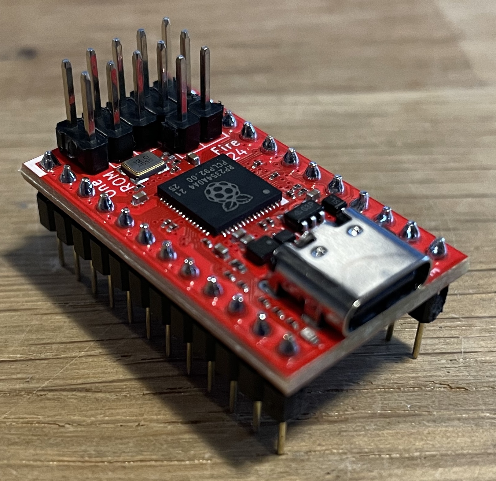
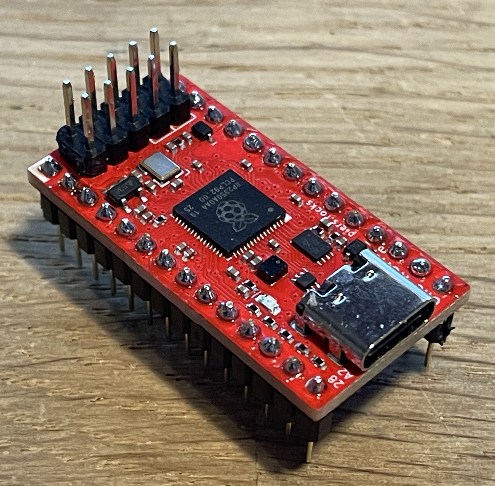

# One ROM

**[One ROM](https://onerom.org) - One ROM To Rule Them All**

The most flexible ROM replacement for your retro computer.  It is highly configurable and low-cost.  Get them fabbed at JLC for under $5 each in a quantity of 10 or more.

Based on a Raspberry Pi RP2350.

One ROM is available as 24 pin, 28 pin, 32 pin and 40 pin variants, emulating nearly all systems' 24, 28 and 32 pin ROMs, plus 16-bit 40 pin ROMs used in systems like the Amiga A500.  One ROM supports any of the possible chip select configurations for 24 and 28 pin with a single hardware variant for that pin count, and can serve different images to multiple ROM sockets simultaneously (currently 24 pin only).

Replaces failed ROMs in Amiga A500s, Commodore 64s, VIC-20s, PETs, Ataris, BBC, TIs, disk drives, IBM PCs and many other types of systems, like pinball machines, drum machines and music synthesizers.

ROM types replaced:
- 24 pin: 2704, 2708, 2716, 2732, 2316, 2332, 2364
- 28 pin: 27x64, 27x128, 27x256, 27x512, 23128, 23256, 23512, 231024, TCS531000
- 32 pin: 27C010, 27C020, 27C040, 27C301, SST39SF010, SST39SF020
- 40 pin: 27C400

One ROM also supports some RAM chips of the correct footprint, including the 6116 and 2016 2K SRAM.

One ROM shares firmware and configuration tools across all of its variants, making it a "one stop shop" for ROM replacement.  Firmware is actively supported and developed, with new features and compatibility improvements being added regularly.

One ROM was formerly known as Software Defined Retro ROM (SDRR).

## Quick Start

See https://onerom.org/start/

## Hardware

These are the latest Fire 24 and 28 pin versions.  See [sdrr-pcb](sdrr-pcb/README.md) for all of the hardware designs and [current recommended revisions](sdrr-pcb/README.md#recommended-revisions).

    
    

All the hardware design files required to manufacture your own One ROMs are available in the [sdrr-pcb](sdrr-pcb) directory

If you'd rather buy them pre-made, see known vendors at https://onerom.org/buy.

## Key Features

**Cheap** - Based on sub-$2 RP2350 microcontroller.

**Fast** enough for PETs, VIC-20s, C64s, Amiga A500, BBCs, Ataris, TI-99, Apple II, 1541s, IEEE drives, etc.

**Same footprint** as original ROM sockets.

**USB Programming** - no dedicated programmer required, program from your [browser](https://onerom.org/web) or [PC/Mac/Linux](https://onerom.org/cli).

**Quick programming** - flash in <10 seconds.

**Reflash in situ** - no need to remove the ROM from the host when reprogramming.

**Software configurable** chip select lines for mask programmed ROMs - no hardware jumpers required.

Stores up to **16 ROM images** of different sizes and chip select configurations.  Image selectable via jumpers.

**Replace multiple ROMs with one ROM** - a single One ROM 24 can replace up to 3 original ROMs e.g. all of C64 kernel, BASIC, character set.

**Dynamic bank switching** - switch between ROM images on the fly, e.g. different char ROMs with One ROM 24.

**Modifiable at runtime** - change the ROM images being served and access telemetry from the ROM at runtime using USB and the [CLI](https://onerom.org/cli)

**Open source** software and hardware.

## Videos

Why use One ROM:

The hardware family:

## Documentation

The best place to started with One ROM is https://onerom.org/start/.

Links to other documentation provided below.

| Topic | Description |
|-------|-------------|
| [Building from source](ci/docker/README.md) | How to build the firmware from source using the provided Docker container. |
| [Installation](INSTALL.md) | Manual installation of build system dependencies. |
| [Available Configurations](onerom-config/README.md) | Various pre-collated ROM collection configurations. |
| [Image Selection](docs/IMAGE-SELECTION.md) | How to tell One ROM which of the installed ROM images to serve. |
| [Image Sets](docs/MULTI-ROM-SETS.md) | How to use a single One ROM to support multiple ROMs simultaneously or to dynamically switch between images. |
| [Logging](docs/LOGGING.md) | How to enable and use One ROM logging. |
| [ROMs Glorious ROMs](docs/ROMS-GLORIOUS-ROMS.md) | Everything you ever wanted to know about 23/27 series ROMs but were afraid to ask. |
| [Voltage Levels](docs/VOLTAGE-LEVELS.md) | How the One ROM supports the required logic voltage levels. |
| [Pi Pico Programmer](docs/PI-PICO-PROGRAMMER.md) | How to use a $5 Raspberry Pi Pico as a programmer for One ROM. |
| [License](LICENSE.md) | One ROM software and hardware licenses. |

## Problems

If you hit a problem you'd like help with, raise an issue at [the project issues page](https://github.com/piersfinlayson/one-rom/issues) or open a thread at [GitHub Discussions](https://github.com/piersfinlayson/one-rom/discussions).  Please provide:

- your One ROM PCB type and revision (or a photo if you're unsure)
- the retro system you are trying to One ROM with
- details of the problem.

## License

See [LICENSE](LICENSE.md) for software and hardware licensing information.
